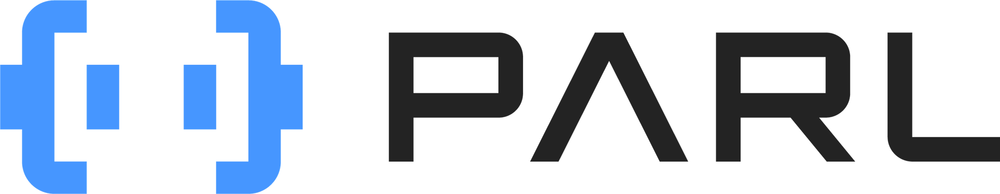

我们是来自百度的PARL强化学习团队

目前我们除了通过强化学习支持公司内外的业务之外，还深耕强化学习的前沿技术，开展的工作线条包括但不限于：

- 高性能RL并行框架PARL的研发（https://github.com/PaddlePaddle/PARL, 2k star)
- 参与业内的国际RL赛事（我们团队已经连续三年在NeurIPS RL 赛事中拿下冠军名次了，已开源）
- 学术论文的投稿
- 机器人控制（无人机、四足机械狗控制）

公司内的业务落地包括推荐系统、百度地图、广告排序、百度智能云等。
